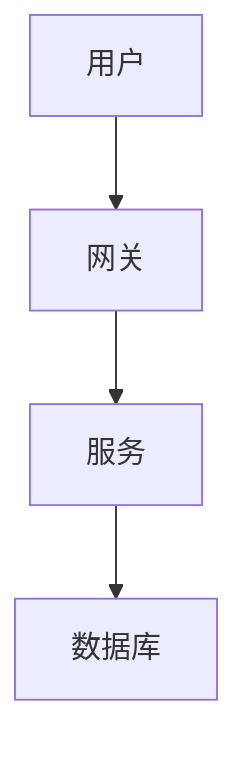

# AI 生图工具对比与推荐

**创建日期:** 2026-02-28  
**更新日期:** 2026-02-28  
**标签:** #AI 生图 #技术图表 #工具对比 #Mermaid

---

## 📊 工具总览

| 工具 | 类型 | 质量 | 速度 | 成本 | 推荐场景 |
|------|------|------|------|------|----------|
| **Mermaid** | 文本生成图表 | ⭐⭐⭐⭐⭐ | ⭐⭐⭐⭐⭐ | 免费 | 技术架构图、流程图 |
| **通义万相 2.5** | AI 生图 | ⭐⭐⭐⭐⭐⭐ | ⭐⭐⭐ | 付费 | 封面图、概念图 |
| **Excalidraw** | 手绘风格 | ⭐⭐⭐⭐⭐ | ⭐⭐⭐⭐ | 免费 | 技术分享、博客 |
| **PlantUML** | UML 图 | ⭐⭐⭐⭐ | ⭐⭐⭐⭐ | 免费 | 软件工程图 |
| **article-cover** | 文章配图 | ⭐⭐⭐⭐ | ⭐⭐⭐ | 付费 | 博客封面 |

---

## 🎯 各工具详细对比

### 1. Mermaid（⭐⭐⭐⭐⭐ 强烈推荐）

**定位:** 文本生成技术图表

**优势:**
- ✅ 完全免费
- ✅ 文本描述，精确可控
- ✅ SVG 格式，无限缩放
- ✅ GitHub/Obsidian 原生支持
- ✅ 可版本控制
- ✅ 易于修改和维护

**劣势:**
- ❌ 只能生成结构化图表
- ❌ 不支持艺术化效果

**适用场景:**
- ✅ 技术架构图
- ✅ 流程图
- ✅ 时序图
- ✅ 类图、ER 图
- ✅ 部署图

**使用示例:**
```bash
node tech-diagram.js mermaid "系统架构" "A[用户] --> B[网关]
B --> C[服务]
C --> D[数据库]"
```

**输出:**
- SVG（矢量图，推荐）
- PNG（位图）
- Markdown（GitHub/Obsidian）

---

### 2. 通义万相 2.5（⭐⭐⭐⭐⭐⭐ 高质量）

**定位:** AI 艺术图生成

**优势:**
- ✅ 最高质量（2026 最新模型）
- ✅ 支持中文提示词
- ✅ 艺术效果好
- ✅ 适合封面图

**劣势:**
- ❌ 需要 API Key（付费）
- ❌ 生成速度慢（20-30 秒）
- ❌ 不可控，需要多次尝试
- ❌ 图片链接 24 小时有效

**适用场景:**
- ✅ 文章封面
- ✅ 概念图
- ✅ 宣传图
- ✅ 社交媒体配图

**使用示例:**
```bash
node tech-diagram.js ai "AI 推荐系统技术架构" "科技感，蓝色调，神经网络，数据流"
```

**成本:**
- 按生成次数计费
- 约 0.1-0.3 元/张

---

### 3. Excalidraw（⭐⭐⭐⭐⭐ 手绘风）

**定位:** 手绘风格技术图

**优势:**
- ✅ 手绘风格，亲和力强
- ✅ 专业感与艺术感平衡
- ✅ 支持中文
- ✅ 免费开源

**劣势:**
- ❌ 需要手动绘制（或 AI 辅助）
- ❌ 不适合复杂图表

**适用场景:**
- ✅ 技术分享 PPT
- ✅ 博客插图
- ✅ 文档配图
- ✅ 教学材料

**使用示例:**
```bash
node tech-diagram.js excali "系统架构手绘" "简洁，手绘风格"
```

---

### 4. PlantUML（⭐⭐⭐⭐ UML 专用）

**定位:** 专业 UML 图生成

**优势:**
- ✅ 专业 UML 支持
- ✅ 文本描述
- ✅ 免费开源
- ✅ 适合软件工程

**劣势:**
- ❌ 语法较复杂
- ❌ 样式相对固定

**适用场景:**
- ✅ 类图
- ✅ 时序图
- ✅ 用例图
- ✅ 活动图

---

### 5. article-cover（⭐⭐⭐⭐ 文章配图）

**定位:** 文章封面图生成

**优势:**
- ✅ 专为文章优化
- ✅ 自动匹配主题
- ✅ 尺寸合适

**劣势:**
- ❌ 需要 API Key
- ❌ 质量一般

**适用场景:**
- ✅ 博客文章封面
- ✅ 公众号配图

---

## 🎨 推荐组合方案

### 方案 1: 技术文档（推荐）

**组合:** Mermaid SVG + Markdown

```bash
# 生成架构图
node tech-diagram.js mermaid "系统架构" "A-->B-->C"

# 直接在 Markdown 中使用
```

**优势:**
- 完全免费
- 可版本控制
- GitHub/Obsidian 原生支持
- 无限缩放

---

### 方案 2: 技术博客

**组合:** Mermaid 图表 + AI 封面

```bash
# 生成文章封面
node tech-diagram.js ai "AI 技术博客封面" "科技感，蓝色调"

# 生成文中图表
node tech-diagram.js mermaid "流程图" "A-->B"
```

**优势:**
- 封面吸引眼球
- 图表清晰专业
- 成本可控

---

### 方案 3: 技术分享

**组合:** Excalidraw 手绘风

```bash
node tech-diagram.js excali "系统架构" "手绘风格，简洁"
```

**优势:**
- 亲和力强
- 专业又不失活泼
- 适合演讲

---

### 方案 4: 正式报告

**组合:** Mermaid + 专业配色

```bash
# 使用专业主题
node tech-diagram.js mermaid "架构图" "A-->B" --theme professional
```

**优势:**
- 专业正式
- 配色统一
- 可打印

---

## 📝 实际案例对比

### 案例：MaaS 推荐系统架构图

#### Mermaid 生成

**输入:**
```
architectureDiagram
  cluster: 用户层 { Web App }
  cluster: 网关层 { API Gateway }
  cluster: 业务层 { 推荐引擎 用户画像 }
  cluster: 数据层 { MySQL Redis ES }
```

**输出质量:** ⭐⭐⭐⭐⭐
- 清晰展示系统层次
- 箭头表示数据流
- 可无限缩放
- 文件小（几 KB）

**生成时间:** < 1 秒

**成本:** 免费

---

#### AI 生成

**输入:**
```
AI 推荐系统技术架构图，科技感，蓝色调，
神经网络，数据流，现代化，专业
```

**输出质量:** ⭐⭐⭐⭐⭐⭐
- 艺术效果好
- 视觉冲击力强
- 但细节不可控

**生成时间:** 20-30 秒

**成本:** 约 0.2 元

---

## 🎯 最佳实践建议

### 技术文档

**推荐:** Mermaid 100%

```markdown
## 系统架构


```

**理由:**
- 免费
- 可维护
- 版本控制友好

---

### 技术博客

**推荐:** Mermaid 图表 + AI 封面

```bash
# 封面（AI 生成）
node tech-diagram.js ai "博客封面" "AI 技术"

# 图表（Mermaid）
node tech-diagram.js mermaid "流程图" "A-->B"
```

**理由:**
- 封面吸引点击
- 图表清晰准确
- 成本可控

---

### 技术分享 PPT

**推荐:** Excalidraw 手绘风

```bash
node tech-diagram.js excali "架构手绘" "简洁"
```

**理由:**
- 亲和力强
- 不失专业
- 适合演讲

---

### 正式报告/论文

**推荐:** Mermaid + 专业主题

```bash
node tech-diagram.js mermaid "架构图" "A-->B" --theme professional
```

**理由:**
- 正式专业
- 可打印
- 符合规范

---

## 💡 使用技巧

### Mermaid 技巧

1. **使用 subgraph 分组**
   ```mermaid
   graph TB
     subgraph 前端
       A[Web]
       B[Mobile]
     end
     subgraph 后端
       C[API]
       D[DB]
     end
   ```

2. **自定义样式**
   ```mermaid
   graph TB
     A[节点] --> B[节点]
     style A fill:#e1f5ff
     style B fill:#c8e6c9
   ```

3. **使用注释**
   ```mermaid
   graph TB
     A --> B
     note right of B: 这是注释
   ```

### AI 生图技巧

1. **详细描述**
   ```
   ❌ "架构图"
   ✅ "云原生技术架构图，微服务，容器，Kubernetes，
       蓝色调，科技感，现代风格，高分辨率"
   ```

2. **指定风格**
   ```
   "photographic（写实）/illustration（插画）/
    digital-art（数字艺术）"
   ```

3. **多次尝试**
   - AI 生成有随机性
   - 多生成几次选最好的

---

## 📊 成本对比

| 工具 | 单次成本 | 月成本（100 次） | 年成本 |
|------|----------|------------------|--------|
| **Mermaid** | ¥0 | ¥0 | ¥0 |
| **通义万相** | ¥0.2 | ¥20 | ¥240 |
| **Excalidraw** | ¥0 | ¥0 | ¥0 |
| **PlantUML** | ¥0 | ¥0 | ¥0 |
| **article-cover** | ¥0.15 | ¥15 | ¥180 |

**推荐:** 以 Mermaid 为主，AI 生图为辅，成本最优。

---

## 🚀 快速选择指南

```
需要生成什么图？
│
├─ 技术架构图/流程图/时序图
│  └─> Mermaid（免费、精确、可维护）
│
├─ 文章封面/概念图
│  └─> 通义万相 2.5（高质量、艺术感）
│
├─ 技术分享/博客插图
│  └─> Excalidraw（手绘风、亲和力）
│
├─ UML 图（类图/用例图）
│  └─> PlantUML（专业）
│
└─ 快速配图
   └─> article-cover（便捷）
```

---

## 📞 工具链接

- **tech-diagram:** `/home/admin/.openclaw/workspace-wecom-dm-yefeng/skills/tech-diagram/`
- **article-cover:** `/home/admin/.openclaw/workspace-wecom-dm-yefeng/skills/article-cover/`
- **Mermaid 官方:** https://mermaid.js.org/
- **通义万相:** https://wanx.aliyun.com/
- **Excalidraw:** https://excalidraw.com/

---

## 📋 总结

### 最推荐方案

**技术图表:** Mermaid（tech-diagram skill）
- 免费、精确、可维护
- GitHub/Obsidian 原生支持
- 适合 90% 的技术场景

**艺术配图:** 通义万相 2.5
- 高质量封面图
- 作为补充使用

**手绘风格:** Excalidraw
- 技术分享、博客
- 增加亲和力

---

**更新日期:** 2026-02-28  
**维护者:** tech-diagram 团队

---

*选择合适的工具，让技术图表更简单！* 🎨
