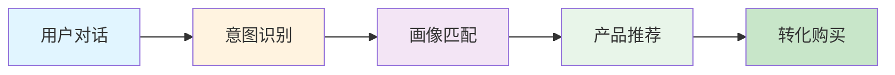

# 阿里云 MaaS 产品智能推荐技术方案

**创建日期:** 2026-02-28  
**版本:** v1.0  
**标签:** #MaaS #智能推荐 #阿里云 #万小域 #技术方案 #AI


---

## 📋 目录

- [项目概述](#项目概述)
- [整体架构](#整体架构)
- [用户画像与对话记忆](#用户画像与对话记忆)
- [推荐策略](#推荐策略)
- [MaaS 产品知识库](#maas 产品知识库)
- [技术实现](#技术实现)
- [效果评估](#效果评估)
- [实施计划](#实施计划)

---

## 🎯 项目概述

### 背景

阿里云 MaaS（Model as a Service）平台提供多种 AI 模型服务，包括通义千问、通义万相、语音识别、图像生成等。用户在万小域 AI 智能体对话过程中，往往有潜在的 MaaS 产品需求，但缺乏精准的产品推荐机制。

### 目标

基于用户离线画像和实时对话内容，构建智能推荐系统，在对话过程中精准推荐阿里云 MaaS 产品，提升：
- **转化率** - 从咨询到购买
- **用户体验** - 个性化推荐
- **产品认知** - 帮助用户了解适合的 MaaS 产品

### 核心价值



---

## 🏗️ 整体架构


### 系统架构图

```
┌─────────────────────────────────────────────────────────────────┐
│                        用户交互层                                │
│  ┌─────────────┐  ┌─────────────┐  ┌─────────────┐             │
│  │  万小域 AI   │  │  阿里云控制台│  │  API 调用    │             │
│  └──────┬──────┘  └──────┬──────┘  └──────┬──────┘             │
└─────────┼────────────────┼────────────────┼─────────────────────┘
          │                │                │
          ▼                ▼                ▼
┌─────────────────────────────────────────────────────────────────┐
│                        推荐引擎层                                │
│  ┌─────────────┐  ┌─────────────┐  ┌─────────────┐             │
│  │  意图识别   │  │  画像匹配   │  │  推荐排序   │             │
│  │   Module    │  │   Module    │  │   Module    │             │
│  └──────┬──────┘  └──────┬──────┘  └──────┬──────┘             │
└─────────┼────────────────┼────────────────┼─────────────────────┘
          │                │                │
          ▼                ▼                ▼
┌─────────────────────────────────────────────────────────────────┐
│                        数据服务层                                │
│  ┌─────────────┐  ┌─────────────┐  ┌─────────────┐             │
│  │  用户画像   │  │  对话记忆   │  │  产品知识库 │             │
│  │   Store     │  │   Store     │  │   Store     │             │
│  └─────────────┘  └─────────────┘  └─────────────┘             │
└─────────────────────────────────────────────────────────────────┘
```

### 核心模块

| 模块 | 职责 | 技术栈 |
|------|------|--------|
| **意图识别** | 分析用户对话意图 | NLP + 规则引擎 |
| **画像匹配** | 匹配用户历史行为 | 向量检索 + 规则 |
| **推荐排序** | 排序推荐结果 | 机器学习模型 |
| **用户画像** | 存储用户特征 | Redis + MySQL |
| **对话记忆** | 存储对话历史 | MongoDB |
| **产品知识库** | MaaS 产品信息 | Elasticsearch |

---

## 👤 用户画像与对话记忆

### 用户画像体系

#### 1. 基础属性

```json
{
  "userId": "user_123456",
  "accountType": "企业/个人",
  "industry": "互联网/金融/教育/制造",
  "companySize": "0-50/50-200/200-1000/1000+",
  "registrationDate": "2024-01-15",
  "accountLevel": "L1/L2/L3/L4",
  "region": "华东/华北/华南/海外"
}
```

#### 2. 消费行为

```json
{
  "totalSpend": 50000,
  "monthlySpend": 5000,
  "productCategories": ["ECS", "RDS", "OSS", "MaaS"],
  "purchaseFrequency": "高频/中频/低频",
  "lastPurchaseDate": "2026-02-20",
  "paymentMethod": "按量/包年包月"
}
```

#### 3. 技术偏好

```json
{
  "preferredModels": ["Qwen", "StableDiffusion"],
  "apiUsage": "高频/中频/低频",
  "technicalLevel": "专家/进阶/入门",
  "preferredLanguages": ["Python", "Java", "Node.js"],
  "deploymentPreference": "云端/混合/本地"
}
```

#### 4. 业务场景

```json
{
  "useCases": ["客服对话", "内容生成", "图像识别"],
  "industryScenarios": ["电商", "金融风控", "教育"],
  "painPoints": ["成本高", "效果差", "部署复杂"],
  "goals": ["提升效率", "降低成本", "创新业务"]
}
```

### 画像标签体系

```
用户标签
├── 基础标签
│   ├── 用户类型：企业/个人
│   ├── 行业分类：互联网/金融/教育/制造/其他
│   └── 地域分布：华东/华北/华南/海外
├── 行为标签
│   ├── 消费能力：高/中/低
│   ├── 活跃度：高频/中频/低频
│   └── 产品偏好：计算/存储/网络/AI
├── 技术标签
│   ├── 技术等级：专家/进阶/入门
│   ├── API 使用：频繁/偶尔/从不
│   └── 部署偏好：云原生/混合/传统
└── 需求标签
    ├── 业务场景：客服/营销/研发/运维
    ├── 痛点类型：成本/性能/安全/易用
    └── 购买意向：高/中/低
```

### 对话记忆系统

#### 1. 对话历史存储

```javascript
{
  "sessionId": "sess_abc123",
  "userId": "user_123456",
  "messages": [
    {
      "role": "user",
      "content": "我想做一个智能客服系统",
      "timestamp": "2026-02-28T10:30:00Z",
      "intent": "客服系统",
      "entities": ["智能客服"]
    },
    {
      "role": "assistant",
      "content": "推荐通义千问 + 智能对话...",
      "timestamp": "2026-02-28T10:30:05Z",
      "recommendedProducts": ["Qwen", "IntelligentChat"]
    }
  ],
  "summary": "用户想构建智能客服系统，关注成本和效果",
  "extractedNeeds": ["智能客服", "成本控制", "快速部署"],
  "sentiment": "positive"
}
```

#### 2. 短期记忆（Session 级）

- **当前对话主题**
- **已提及的需求**
- **已推荐的产品**
- **用户反馈**

#### 3. 长期记忆（用户级）

- **历史咨询主题**
- **购买过的产品**
- **偏好和痛点**
- **决策模式**

### 画像更新机制

```
实时事件 ──→ 事件队列 ──→ 画像更新 ──→ 缓存刷新
   │                              │
   ▼                              ▼
对话记录                    推荐引擎
   │                              │
   ▼                              ▼
特征提取                    个性化推荐
```

**更新频率:**
- 实时：对话行为、点击行为
- 小时级：浏览行为、搜索行为
- 天级：消费行为、活跃行为
- 周级：标签聚合、模型更新

---

## 🎯 推荐策略


### 策略总览

```
                    ┌─────────────────┐
                    │   用户请求      │
                    └────────┬────────┘
                             │
              ┌──────────────┼──────────────┐
              │              │              │
              ▼              ▼              ▼
       ┌────────────┐ ┌────────────┐ ┌────────────┐
       │  规则推荐  │ │  协同过滤  │ │  内容推荐  │
       │  (20%)     │ │  (30%)     │ │  (50%)     │
       └─────┬──────┘ └─────┬──────┘ └─────┬──────┘
             │              │              │
             └──────────────┼──────────────┘
                            │
                            ▼
                    ┌───────────────┐
                    │   融合排序    │
                    │  (LTR 模型)   │
                    └───────┬───────┘
                            │
                            ▼
                    ┌───────────────┐
                    │  最终推荐列表 │
                    └───────────────┘
```

### 1. 规则推荐（20%）

#### 1.1 关键词匹配

```python
KEYWORD_RULES = {
    "客服": ["智能对话", "Qwen", "语音识别"],
    "图像": ["通义万相", "图像识别", "内容审核"],
    "文档": ["文档理解", "OCR", "知识抽取"],
    "语音": ["语音识别", "语音合成", "实时语音"],
    "视频": ["视频理解", "视频标签", "内容审核"],
    "搜索": ["智能搜索", "语义理解", "向量检索"],
    "推荐": ["个性化推荐", "召回排序", "用户画像"],
    "风控": ["内容安全", "风险识别", "反欺诈"],
}

def rule_based_recommend(keywords):
    products = set()
    for keyword in keywords:
        if keyword in KEYWORD_RULES:
            products.update(KEYWORD_RULES[keyword])
    return list(products)
```

#### 1.2 场景匹配

```python
SCENARIO_RULES = {
    "智能客服": {
        "products": ["Qwen", "IntelligentChat", "VoiceBot"],
        "priority": "high",
        "reason": "智能客服场景需要对话理解和语音交互能力"
    },
    "内容创作": {
        "products": ["通义万相", "Qwen", "文案生成"],
        "priority": "high",
        "reason": "内容创作需要文本和图像生成能力"
    },
    "数据分析": {
        "products": ["文档理解", "知识抽取", "智能洞察"],
        "priority": "medium",
        "reason": "数据分析需要结构化信息提取能力"
    },
    "安全合规": {
        "products": ["内容安全", "风险识别", "隐私保护"],
        "priority": "high",
        "reason": "安全合规需要内容审核和风险控制"
    }
}
```

#### 1.3 价格匹配

```python
PRICE_RULES = {
    "low_budget": {
        "condition": "user.monthly_spend < 1000",
        "products": ["按量付费产品", "免费额度产品"],
        "message": "推荐高性价比方案，充分利用免费额度"
    },
    "medium_budget": {
        "condition": "1000 <= user.monthly_spend <= 10000",
        "products": ["包年包月", "资源包"],
        "message": "推荐优惠套餐，降低成本"
    },
    "high_budget": {
        "condition": "user.monthly_spend > 10000",
        "products": ["企业版", "定制方案", "专属服务"],
        "message": "推荐企业级方案，提供专属支持"
    }
}
```

### 2. 协同过滤（30%）

#### 2.1 用户相似度

```python
def user_similarity(user1, user2):
    """
    计算用户相似度
    """
    # 基础属性相似度
    base_sim = cosine_similarity(user1.base_features, user2.base_features)
    
    # 行为相似度
    behavior_sim = jaccard_similarity(user1.products, user2.products)
    
    # 场景相似度
    scenario_sim = cosine_similarity(user1.scenarios, user2.scenarios)
    
    # 加权
    return 0.3 * base_sim + 0.4 * behavior_sim + 0.3 * scenario_sim
```

#### 2.2 产品共现

```python
# 产品共现矩阵
product_cooccurrence = {
    "Qwen": ["智能对话", "文案生成", "代码助手"],
    "通义万相": ["图像生成", "风格迁移", "图像编辑"],
    "语音识别": ["语音合成", "实时语音", "语音分析"],
    "内容安全": ["风险识别", "内容审核", "隐私保护"]
}

def collaborative_filtering(user_id):
    """
    基于协同过滤的推荐
    """
    # 找到相似用户
    similar_users = find_similar_users(user_id, top_k=50)
    
    # 收集相似用户购买的产品
    candidate_products = collect_products(similar_users)
    
    # 计算产品得分
    product_scores = calculate_product_scores(candidate_products)
    
    return rank_products(product_scores)
```

### 3. 内容推荐（50%）

#### 3.1 对话意图识别

```python
INTENT_MODEL = load_model("intent_classification")

def extract_intent(dialogue):
    """
    从对话中提取用户意图
    """
    # 使用 NLP 模型识别意图
    intent = INTENT_MODEL.predict(dialogue)
    
    # 提取关键实体
    entities = extract_entities(dialogue)
    
    # 分析情感
    sentiment = analyze_sentiment(dialogue)
    
    return {
        "intent": intent,
        "entities": entities,
        "sentiment": sentiment,
        "confidence": intent.confidence
    }
```

#### 3.2 产品匹配度计算

```python
def calculate_match_score(user, product, dialogue_context):
    """
    计算用户 - 产品匹配度
    """
    scores = {}
    
    # 1. 需求匹配度 (40%)
    scores['need_match'] = calculate_need_match(
        dialogue_context.extracted_needs,
        product.features
    )
    
    # 2. 场景匹配度 (25%)
    scores['scenario_match'] = calculate_scenario_match(
        user.scenarios,
        product.scenarios
    )
    
    # 3. 预算匹配度 (20%)
    scores['budget_match'] = calculate_budget_match(
        user.budget,
        product.price
    )
    
    # 4. 技术匹配度 (15%)
    scores['tech_match'] = calculate_tech_match(
        user.technical_level,
        product.complexity
    )
    
    # 加权总分
    total_score = (
        0.40 * scores['need_match'] +
        0.25 * scores['scenario_match'] +
        0.20 * scores['budget_match'] +
        0.15 * scores['tech_match']
    )
    
    return {
        'total': total_score,
        'breakdown': scores
    }
```

#### 3.3 深度学习排序模型

```python
class MaaSRecommendationModel(nn.Module):
    def __init__(self):
        super().__init__()
        
        # 用户特征编码
        self.user_encoder = nn.Sequential(
            nn.Linear(user_feature_dim, 256),
            nn.ReLU(),
            nn.Linear(256, 128)
        )
        
        # 产品特征编码
        self.product_encoder = nn.Sequential(
            nn.Linear(product_feature_dim, 256),
            nn.ReLU(),
            nn.Linear(256, 128)
        )
        
        # 对话上下文编码
        self.context_encoder = nn.LSTM(
            input_size=word_embedding_dim,
            hidden_size=256,
            num_layers=2,
            bidirectional=True
        )
        
        # 融合层
        self.fusion = nn.Sequential(
            nn.Linear(128 + 128 + 512, 256),
            nn.ReLU(),
            nn.Dropout(0.3),
            nn.Linear(256, 1)
        )
    
    def forward(self, user_features, product_features, context):
        user_emb = self.user_encoder(user_features)
        product_emb = self.product_encoder(product_features)
        context_emb, _ = self.context_encoder(context)
        context_emb = context_emb[-1]
        
        combined = torch.cat([user_emb, product_emb, context_emb], dim=1)
        score = self.fusion(combined)
        
        return torch.sigmoid(score)
```

### 4. 推荐融合与排序

#### 4.1 多策略融合

```python
def fuse_recommendations(rule_recs, cf_recs, content_recs):
    """
    融合多种推荐策略的结果
    """
    all_products = {}
    
    # 收集所有候选产品
    for source, recs in [
        ('rule', rule_recs),
        ('cf', cf_recs),
        ('content', content_recs)
    ]:
        for product in recs:
            if product.id not in all_products:
                all_products[product.id] = {
                    'product': product,
                    'sources': [],
                    'scores': {}
                }
            all_products[product.id]['sources'].append(source)
            all_products[product.id]['scores'][source] = product.score
    
    # 计算融合得分
    for product_id, data in all_products.items():
        scores = data['scores']
        
        # 加权融合
        fused_score = (
            0.2 * scores.get('rule', 0) +
            0.3 * scores.get('cf', 0) +
            0.5 * scores.get('content', 0)
        )
        
        # 多策略加分
        if len(data['sources']) >= 2:
            fused_score *= 1.2
        if len(data['sources']) >= 3:
            fused_score *= 1.3
        
        data['fused_score'] = fused_score
    
    # 排序
    sorted_products = sorted(
        all_products.values(),
        key=lambda x: x['fused_score'],
        reverse=True
    )
    
    return sorted_products[:10]  # 返回 Top 10
```

#### 4.2 多样性控制

```python
def ensure_diversity(recommendations, max_same_category=3):
    """
    确保推荐结果的多样性
    """
    result = []
    category_count = {}
    
    for rec in recommendations:
        category = rec.product.category
        
        if category_count.get(category, 0) < max_same_category:
            result.append(rec)
            category_count[category] = category_count.get(category, 0) + 1
    
    return result
```

### 5. 推荐解释生成

```python
def generate_explanation(user, product, match_scores):
    """
    生成推荐解释
    """
    explanations = []
    
    # 基于最高匹配维度
    max_score_dim = max(match_scores.items(), key=lambda x: x[1])[0]
    
    if max_score_dim == 'need_match':
        explanations.append(f"根据您的对话需求，{product.name} 可以解决您提到的问题")
    
    if max_score_dim == 'scenario_match':
        explanations.append(f"{product.name} 在{user.scenarios[0]}场景有成功案例")
    
    if max_score_dim == 'budget_match':
        explanations.append(f"{product.name} 的价格在您的预算范围内")
    
    if max_score_dim == 'tech_match':
        explanations.append(f"{product.name} 适合您的技术团队使用")
    
    # 添加社会证明
    if product.customer_count > 10000:
        explanations.append(f"已有{product.customer_count}家企业使用")
    
    # 添加优惠信息
    if product.has_discount:
        explanations.append(f"当前有{product.discount}优惠")
    
    return "。".join(explanations) + "。"
```

---

## 📚 MaaS 产品知识库

### 产品体系

```
阿里云 MaaS 产品
├── 通义千问系列
│   ├── Qwen-Max（最强性能）
│   ├── Qwen-Plus（平衡性能）
│   ├── Qwen-Turbo（快速响应）
│   └── Qwen-Long（长文档处理）
├── 通义万相系列
│   ├── 图像生成
│   ├── 图像编辑
│   ├── 风格迁移
│   └── 人像处理
├── 语音技术系列
│   ├── 语音识别
│   ├── 语音合成
│   ├── 实时语音
│   └── 语音分析
├── 视觉技术系列
│   ├── 图像识别
│   ├── 视频理解
│   ├── 内容审核
│   └── OCR 识别
├── 语言技术系列
│   ├── 文本分析
│   ├── 文档理解
│   ├── 知识抽取
│   └── 机器翻译
└── 行业解决方案
    ├── 智能客服
    ├── 智能营销
    ├── 智能研发
    └── 智能风控
```

### 产品知识图谱

```python
PRODUCT_KNOWLEDGE = {
    "Qwen-Max": {
        "category": "大语言模型",
        "features": ["最强推理", "复杂任务", "专业领域"],
        "scenarios": ["复杂问答", "代码生成", "专业咨询"],
        "price_tier": "high",
        "technical_level": "intermediate",
        "api_endpoint": "dashscope.chat.completions",
        "pricing": {
            "input": "0.06 元/千 tokens",
            "output": "0.18 元/千 tokens"
        },
        "limits": {
            "context_length": 32768,
            "qps": 10
        },
        "competitors": ["GPT-4", "Claude-3"],
        "advantages": ["中文优化", "性价比高", "本地部署"],
        "use_cases": [
            {
                "name": "智能客服",
                "description": "构建高质量对话系统",
                "implementation": "Qwen + 知识库 + 对话管理"
            },
            {
                "name": "内容创作",
                "description": "自动生成营销文案",
                "implementation": "Qwen + 模板 + 审核"
            }
        ]
    },
    "通义万相": {
        "category": "图像生成",
        "features": ["文生图", "图生图", "风格迁移"],
        "scenarios": ["设计素材", "营销图片", "艺术创作"],
        "price_tier": "medium",
        "technical_level": "beginner",
        # ... 更多属性
    }
}
```

### 产品对比矩阵

| 产品 | 适用场景 | 技术门槛 | 价格区间 | 推荐指数 |
|------|----------|----------|----------|----------|
| Qwen-Max | 复杂任务 | 中 | 高 | ⭐⭐⭐⭐⭐ |
| Qwen-Plus | 通用任务 | 低 | 中 | ⭐⭐⭐⭐⭐ |
| Qwen-Turbo | 简单任务 | 低 | 低 | ⭐⭐⭐⭐ |
| 通义万相 | 图像生成 | 低 | 中 | ⭐⭐⭐⭐ |
| 语音识别 | 语音交互 | 中 | 中 | ⭐⭐⭐⭐ |
| 内容安全 | 内容审核 | 低 | 低 | ⭐⭐⭐⭐⭐ |

### 成功案例库

```python
CASE_STUDIES = [
    {
        "customer": "某电商平台",
        "industry": "电商",
        "challenge": "客服人力成本高，响应慢",
        "solution": "Qwen + 智能对话 + 知识库",
        "results": {
            "cost_reduction": "60%",
            "response_time": "秒级",
            "satisfaction": "95%"
        },
        "products_used": ["Qwen-Max", "IntelligentChat", "KnowledgeBase"]
    },
    {
        "customer": "某金融机构",
        "industry": "金融",
        "challenge": "风控审核效率低，漏判率高",
        "solution": "内容安全 + 风险识别",
        "results": {
            "efficiency": "提升 10 倍",
            "accuracy": "99.5%",
            "coverage": "全渠道"
        },
        "products_used": ["ContentSafety", "RiskIdentification"]
    }
]
```

---

## 🛠️ 技术实现

### 系统架构

```
┌─────────────────────────────────────────────────────────────────────┐
│                           前端交互层                                 │
│  ┌──────────────┐  ┌──────────────┐  ┌──────────────┐              │
│  │  万小域 AI   │  │  控制台嵌入  │  │  移动端 SDK  │              │
│  └──────┬───────┘  └──────┬───────┘  └──────┬───────┘              │
└─────────┼─────────────────┼─────────────────┼───────────────────────┘
          │                 │                 │
          └─────────────────┼─────────────────┘
                            │
                            ▼
┌─────────────────────────────────────────────────────────────────────┐
│                           API 网关层                                 │
│  ┌─────────────────────────────────────────────────────────────┐   │
│  │  负载均衡 + 限流 + 鉴权 + 日志                               │   │
│  └─────────────────────────────────────────────────────────────┘   │
└─────────────────────────────────────────────────────────────────────┘
                            │
                            ▼
┌─────────────────────────────────────────────────────────────────────┐
│                          推荐服务层                                  │
│  ┌─────────────┐  ┌─────────────┐  ┌─────────────┐  ┌────────────┐ │
│  │  意图识别   │  │  特征工程   │  │  模型推理   │  │  结果排序  │ │
│  │   Service   │  │   Service   │  │   Service   │  │  Service   │ │
│  └─────────────┘  └─────────────┘  └─────────────┘  └────────────┘ │
└─────────────────────────────────────────────────────────────────────┘
                            │
                            ▼
┌─────────────────────────────────────────────────────────────────────┐
│                          数据存储层                                  │
│  ┌─────────┐  ┌─────────┐  ┌─────────┐  ┌─────────┐  ┌──────────┐ │
│  │  MySQL  │  │ Redis   │  │  Mongo  │  │   ES    │  │  OSS     │ │
│  │  用户   │  │  缓存   │  │  对话   │  │  产品   │  │  模型    │ │
│  └─────────┘  └─────────┘  └─────────┘  └─────────┘  └──────────┘ │
└─────────────────────────────────────────────────────────────────────┘
```

### 核心接口

#### 1. 推荐 API

```python
@app.post("/api/v1/recommend")
async def recommend(request: RecommendationRequest):
    """
    获取 MaaS 产品推荐
    """
    # 1. 获取用户画像
    user_profile = await get_user_profile(request.user_id)
    
    # 2. 获取对话上下文
    dialogue_context = await get_dialogue_context(request.session_id)
    
    # 3. 提取意图
    intent = await extract_intent(dialogue_context)
    
    # 4. 多策略推荐
    rule_recs = await rule_based_recommend(intent, user_profile)
    cf_recs = await collaborative_filtering(request.user_id)
    content_recs = await content_based_recommend(intent, user_profile)
    
    # 5. 融合排序
    fused_recs = fuse_recommendations(rule_recs, cf_recs, content_recs)
    
    # 6. 多样性控制
    diverse_recs = ensure_diversity(fused_recs)
    
    # 7. 生成解释
    for rec in diverse_recs:
        rec.explanation = generate_explanation(
            user_profile, rec.product, rec.match_scores
        )
    
    return {
        "recommendations": diverse_recs,
        "intent": intent,
        "session_id": request.session_id
    }
```

#### 2. 反馈 API

```python
@app.post("/api/v1/feedback")
async def feedback(request: FeedbackRequest):
    """
    收集推荐反馈
    """
    # 记录反馈
    await save_feedback({
        "user_id": request.user_id,
        "product_id": request.product_id,
        "action": request.action,  # click/view/purchase
        "timestamp": datetime.now()
    })
    
    # 更新用户画像
    await update_user_profile(request.user_id, {
        "interacted_products": request.product_id,
        "last_interaction": datetime.now()
    })
    
    # 更新推荐模型（在线学习）
    if request.action == "purchase":
        await online_learning_update(request.user_id, request.product_id)
    
    return {"status": "success"}
```

### 数据流

```
用户对话
   │
   ▼
┌─────────────┐
│  万小域 AI  │
└──────┬──────┘
       │
       ▼
┌─────────────┐
│  意图识别   │
└──────┬──────┘
       │
       ▼
┌─────────────┐     ┌─────────────┐
│  用户画像   │────▶│  特征融合   │
└─────────────┘     └──────┬──────┘
                           │
       ┌───────────────────┼───────────────────┐
       │                   │                   │
       ▼                   ▼                   ▼
┌─────────────┐     ┌─────────────┐     ┌─────────────┐
│  规则推荐   │     │  协同过滤   │     │  内容推荐   │
└──────┬──────┘     └──────┬──────┘     └──────┬──────┘
       │                   │                   │
       └───────────────────┼───────────────────┘
                           │
                           ▼
                    ┌─────────────┐
                    │  融合排序   │
                    └──────┬──────┘
                           │
                           ▼
                    ┌─────────────┐
                    │  推荐结果   │
                    └─────────────┘
```

---

## 📊 效果评估

### 核心指标

| 指标 | 定义 | 目标值 |
|------|------|--------|
| **CTR** | 推荐点击率 | > 15% |
| **CVR** | 推荐转化率 | > 5% |
| **GMV** | 推荐带来的 GMV | 月增长 20% |
| **NDCG@10** | 推荐排序质量 | > 0.7 |
| **多样性** | 推荐品类多样性 | > 0.5 |
| **覆盖率** | 产品被推荐覆盖率 | > 80% |

### A/B 测试方案

```
实验组设计:
├── 对照组 A: 无推荐
├── 实验组 B: 规则推荐
├── 实验组 C: 规则 + 协同过滤
└── 实验组 D: 全量推荐（规则 + CF+ 内容）

流量分配:
├── A: 25%
├── B: 25%
├── C: 25%
└── D: 25%

评估周期：4 周
```

### 效果监控

```python
class RecommendationMetrics:
    def __init__(self):
        self.metrics = {
            'impressions': 0,
            'clicks': 0,
            'purchases': 0,
            'gmv': 0.0
        }
    
    def record_impression(self, product_id):
        self.metrics['impressions'] += 1
    
    def record_click(self, product_id):
        self.metrics['clicks'] += 1
    
    def record_purchase(self, product_id, amount):
        self.metrics['purchases'] += 1
        self.metrics['gmv'] += amount
    
    def calculate_ctr(self):
        return self.metrics['clicks'] / max(self.metrics['impressions'], 1)
    
    def calculate_cvr(self):
        return self.metrics['purchases'] / max(self.metrics['clicks'], 1)
    
    def report(self):
        return {
            'ctr': f"{self.calculate_ctr():.2%}",
            'cvr': f"{self.calculate_cvr():.2%}",
            'gmv': f"¥{self.metrics['gmv']:,.2f}",
            'total_impressions': self.metrics['impressions']
        }
```

---

## 📅 实施计划


### 第一阶段：基础建设（2 周）

- [ ] 用户画像数据模型设计
- [ ] 对话记忆存储方案
- [ ] MaaS 产品知识库建设
- [ ] 基础规则推荐引擎

### 第二阶段：推荐引擎（4 周）

- [ ] 意图识别模型训练
- [ ] 协同过滤算法实现
- [ ] 内容推荐模型开发
- [ ] 融合排序模型

### 第三阶段：系统集成（2 周）

- [ ] 推荐 API 开发
- [ ] 万小域 AI 集成
- [ ] 控制台嵌入
- [ ] 数据埋点

### 第四阶段：优化迭代（持续）

- [ ] A/B 测试
- [ ] 模型优化
- [ ] 效果监控
- [ ] 用户反馈收集

---

## 🔐 安全与隐私

### 数据安全

- 用户数据加密存储
- 敏感信息脱敏
- 访问权限控制
- 操作日志审计

### 隐私保护

- 用户授权机制
- 数据最小化原则
- 可删除权支持
- 合规性审查

---

## 📝 总结

本技术方案通过构建**用户画像**、**对话记忆**、**推荐策略**、**产品知识库**四大核心模块，实现阿里云 MaaS 产品的智能推荐。

**核心优势:**
1. **精准** - 基于用户画像和实时对话的个性化推荐
2. **智能** - 多策略融合 + 深度学习排序
3. **可解释** - 生成推荐原因，提升信任度
4. **可迭代** - 持续优化模型和策略

**预期效果:**
- CTR 提升 15%+
- CVR 提升 5%+
- GMV 月增长 20%+

---

**文档版本:** v1.0  
**最后更新:** 2026-02-28  
**维护团队:** 阿里云 MaaS 推荐团队

---

*本文档将同步到 GitHub Pages*
